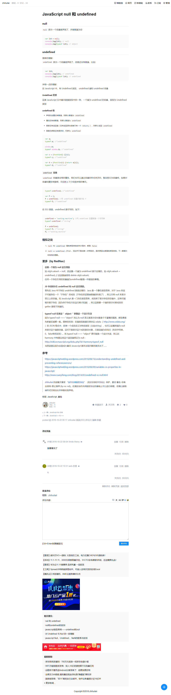

# beautify-cnblogs

1. 本地开发提供 hot reload，可以立即看到效果，不需要每次改动都复制到博客园的设置里
2. 样式重构：导航、文章、底部推荐、评论、广告、侧边栏均提供统一简洁的 UI 风格，截图在最底部可见。
3. 能轻松地插入 icon-font
4. 版权保护：文章底部提供"创作共用版权协议"声明，复制时如果没有复制该声明将强制插入版权声明
5. 响应式设计：适配 PC、Mac、Android 各种尺寸、iOS 各种尺寸
5. 按照博客园的设置项打包出对应的文件，将文件复制到博客园即可，具体映射如下：

映射:
*  dist/beautify-cnblogs-xxx.min.css -> 博客园设置/页面定制css代码
* dist/beautify-cnblogs-xxx.min.js -> 博客园文件/上传
* dist/footer.html -> 博客园设置/页脚Html代码
* dist/header.html -> 博客园设置/页首Html代码
* dist/sidebar.html -> 博客园设置/博客侧边栏公告

# install
windows:   
1. 安装 windows-build-tools
```
npm --add-python-to-path='true' --debug install --global windows-build-tools
```
项目用到了 node-sass 库，node-sass 库在执行 npm install 时，依赖 python 进行编译，
所以我们需要先在全局安装 windows-build-tools。

mac:  
没试过在 mac 上安装，有问题可以提 issue

`npm install`

# run
1. 修改 beautify-cnbologs\config\customfile.js 文件，将博客园名称和地址填写好
2. `npm start`

# build
`npm run build`

# todo
1. 优化开发体验
2. 调整成方便多主题贡献的结构

# screen shot
## 文章视图

## sidebar

