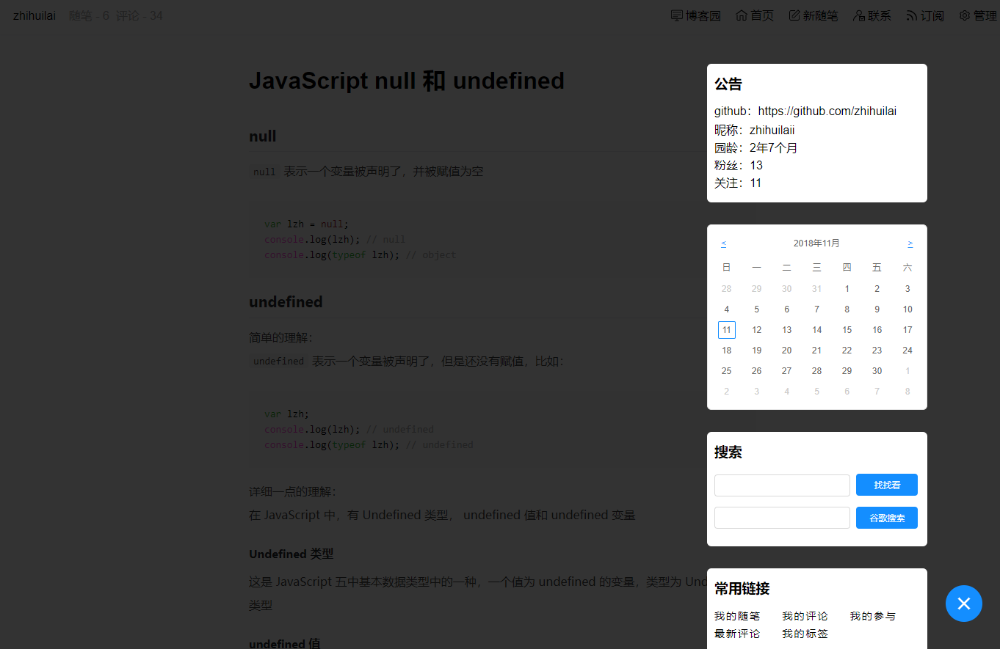

# beautify-cnblogs

方便在本地调整博客园的样式:
1. hot reload
2. 提供图标、版权、媒体查询等工具
3. 打包后 copy 到博客园的设置里即可生效

映射:
*  dist/beautify-cnblogs-xxx.min.css -> 博客园设置/页面定制css代码
* dist/beautify-cnblogs-xxx.min.js -> 博客园文件/上传
* dist/footer.html -> 博客园设置/页脚Html代码
* dist/header.html -> 博客园设置/页首Html代码
* dist/sidebar.html -> 博客园设置/博客侧边栏公告

# install
windows:   
1. 安装 windows-build-tools
```
npm --add-python-to-path='true' --debug install --global windows-build-tools
```
项目用到了 node-sass 库，node-sass 库在执行 npm install 时，依赖 python 进行编译，
所以我们需要先在全局安装 windows-build-tools。

mac:  
没试过在 mac 上安装，有问题可以提 issue

`npm install`

# run
`npm start`

# build
`npm run build`

# todo
1. 调整成方便多主题贡献的结构

# screen shot
## 文章视图

## sidebar

